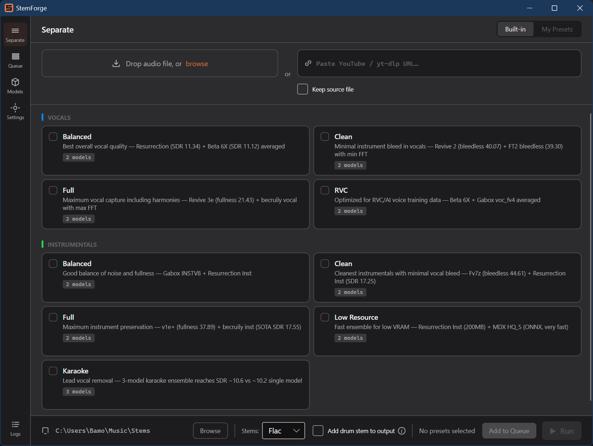
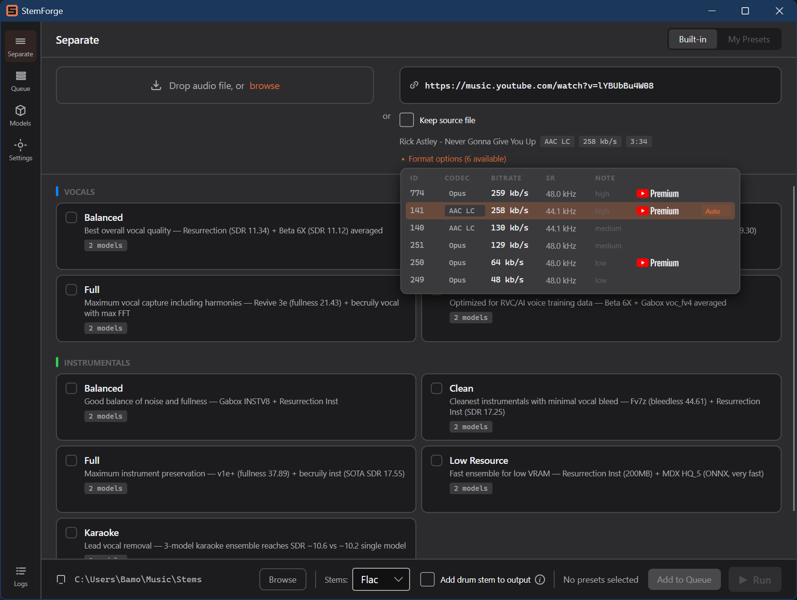
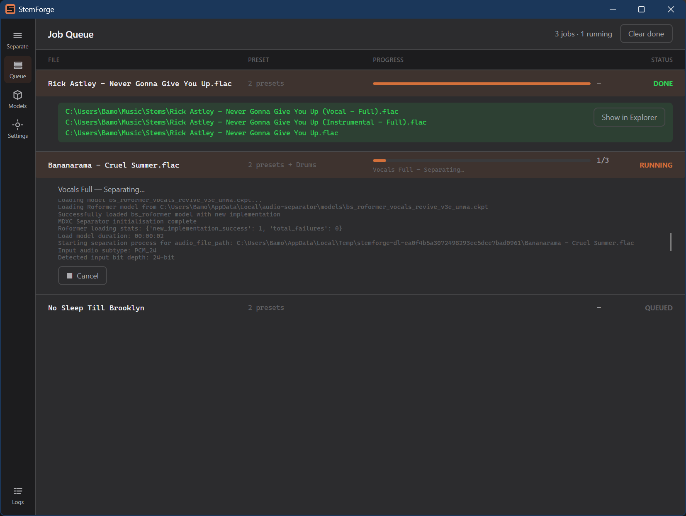
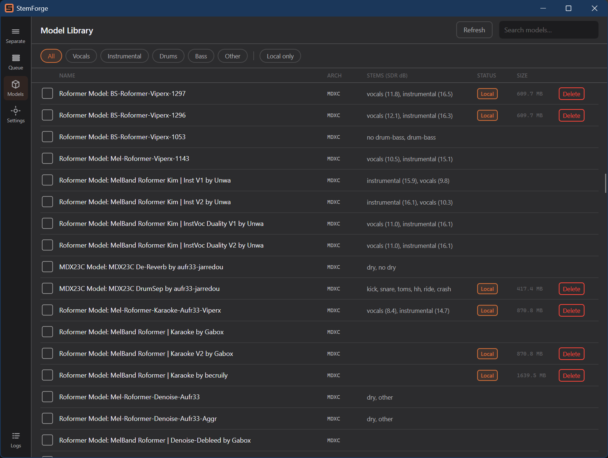
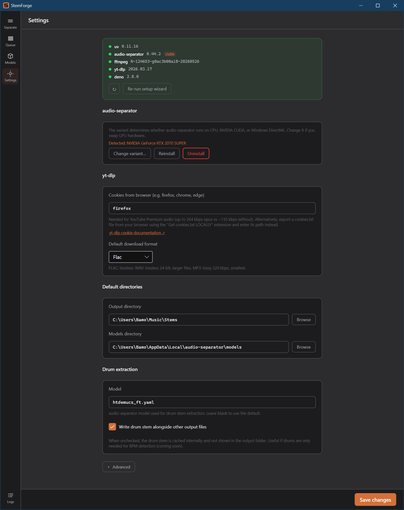
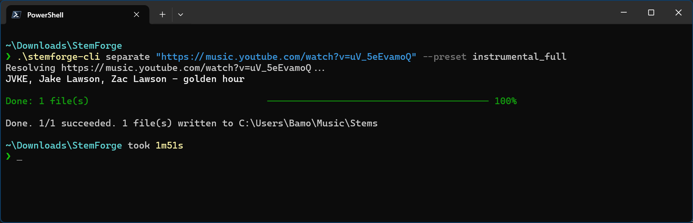
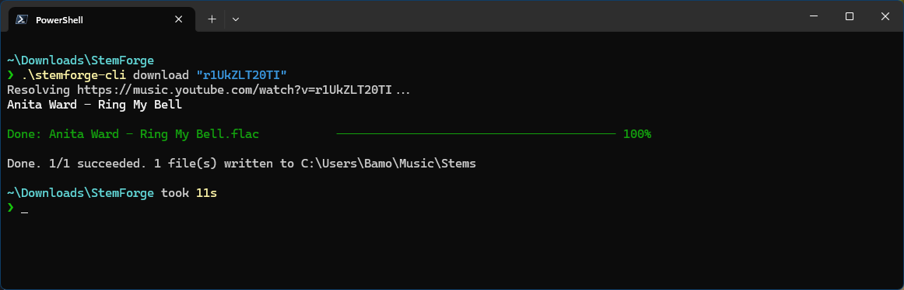

<p align="center">
  
</p>

<h1 align="center">StemForge</h1>

<p align="center">
  Cross-platform desktop app for AI-powered audio stem separation. A polished Avalonia GUI on top of the <a href="https://github.com/nomadkaraoke/python-audio-separator"><code>audio-separator</code></a> Python library with a preset-first workflow, built-in setup wizard, queueable jobs, and YouTube URL ingestion.
</p>

---

## Hear it

Vocal and instrumental stems pulled from [Karyuu &amp; Jaylenn - Another Life](https://music.youtube.com/watch?v=G52OPfQUiZ0) ([NCS](https://ncs.io), royalty-free), separated with StemForge.

**Vocal (Full) preset**

https://github.com/user-attachments/assets/0cca8ecc-d786-4aba-8998-6ebe9ccf793b

**Instrumental (Full) preset**

https://github.com/user-attachments/assets/660daf67-0953-405d-a6ef-1c71e59f6a7b

---

## What it does

Drop in an audio file (or paste a YouTube URL) and StemForge runs one of dozens of separation models, or an ensemble of them, to split the track into stems: vocals, instrumentals, drums, bass, and so on. Pick from the curated built-in presets, or browse the full model catalogue and roll your own.

<p align="center">
  
</p>

### URL ingestion with format selection

Paste a YouTube link and StemForge resolves the available audio formats via `yt-dlp`, picks the best one automatically, and surfaces a picker if you want to override. Any URL `yt-dlp` supports works in principle; YouTube is the most common case, but the same flow handles other sources. Premium audio formats (higher-bitrate opus and AAC) show up when available. See [YouTube authentication](#youtube-authentication-cookies-premium-formats) below if you want StemForge to use them.

<p align="center">
  
</p>

### Job queue

Queue multiple jobs and watch them progress one at a time. Failed jobs surface their error inline.

<p align="center">
  
</p>

### Model catalogue

Browse hundreds of community models from the audio-separator catalogue. Save any combination as a custom preset.

<p align="center">
  
</p>

### Settings

Configure the output directory, default audio format, tool-path overrides, YouTube cookie source, and the GPU variant audio-separator runs on.

<p align="center">
  
</p>

---

## Command-line mode

StemForge ships a companion CLI, `stemforge-cli`, for headless separation and downloads. It uses the same engine, presets, and saved settings as the GUI, so the output directory, default format, and cookie source you configure there all apply.

Separate a local file or a URL into stems with a built-in preset:

```pwsh
stemforge-cli separate "song.flac" --preset vocal_full
stemforge-cli separate "https://music.youtube.com/watch?v=..." --preset instrumental_full
```

<p align="center">
  
</p>

Download audio from a URL without separating, with metadata, provenance, and cover art applied:

```pwsh
stemforge-cli download "https://music.youtube.com/watch?v=..."
```

<p align="center">
  
</p>

Both commands take multiple inputs and process them as a batch, continuing past a failure and ending with a summary and an exit code (0 all succeeded, 2 partial, 1 all failed). Common options:

| Option | Applies to | Effect |
|---|---|---|
| `--preset <id>` | separate | Built-in preset to run; repeat for an ensemble of presets |
| `--output <dir>` | both | Output directory (defaults to the configured Stems folder) |
| `--format <flac\|wav\|mp3\|...>` | both | Output audio format (defaults to the saved setting) |
| `--keep-source` | separate | Keep the source audio alongside the stems |
| `--extract-drums` | separate | Also extract a drums stem |
| `--cookies-from-browser <name>` | both | Browser to read YouTube cookies from (premium formats) |
| `--verbose` | both | Stream full engine logs for troubleshooting (off by default) |

Live progress shows a per-input bar with the current activity. Press Ctrl+C once to cancel the running job cleanly, or twice to force-exit. Run `stemforge-cli presets` to list the built-in presets, and `stemforge-cli --help` for the full command reference.

---

## Getting started (Windows)

1. Open the [Releases](../../releases) page and download the latest `StemForge-vX.Y.Z-win-x64.zip`.
2. Extract anywhere. You'll get a `StemForge/` folder; double-click `StemForge.exe` inside it. No .NET install required.
3. **First-run wizard** offers to install everything you need:
   - `uv`: Python tool manager, ~25 MB, installed via [Astral's official installer](https://astral.sh/uv).
   - `audio-separator`: the separation engine, ~250 MB to 2 GB depending on GPU variant, installed as a uv tool.
   - `ffmpeg`: ~100 MB, bundled binary from [`yt-dlp/FFmpeg-Builds`](https://github.com/yt-dlp/FFmpeg-Builds), dropped into `%LOCALAPPDATA%\StemForge\bin`.
   - `yt-dlp` *(optional, ~17 MB)*: only needed for URL downloads. Bundled binary, not added to your system PATH so it never shadows a yt-dlp you already have installed elsewhere.
   - `deno` *(optional, ~42 MB)*: JS runtime, needed for some YouTube URL workflows. Also bundled, not on PATH. See [YouTube authentication](#youtube-authentication-cookies-premium-formats) for when this matters.
4. Pick your GPU variant: **CPU**, **CUDA** (NVIDIA), or **DirectML** (any modern Windows GPU). The wizard auto-detects what you have.

> **Windows SmartScreen on first launch.** Because `StemForge.exe` isn't code-signed yet, Windows will probably show a *"Windows protected your PC"* prompt the first time you run it. Click **More info** and then **Run anyway** to proceed. This is the standard warning for any unsigned executable; nothing in StemForge needs admin rights or alters system settings.

If you already have any of these tools on your PATH, the wizard detects them and skips re-installing.

> **Linux and macOS.** There's no published Linux or macOS build yet. The app is cross-platform (see [Status](#status)) and you can build and run it from source today (see [For developers](#for-developers)); a packaged download for those platforms may follow.

### What ends up on your PATH vs bundled

`uv` and `audio-separator` install via the upstream installer and land on your PATH, so you can use them outside StemForge too. `ffmpeg`, `yt-dlp`, and `deno` are bundled into `%LOCALAPPDATA%\StemForge\bin` and **not** added to your system PATH. The rationale: a user is plausibly going to want their own `ffmpeg` or `yt-dlp` available system-wide, and StemForge dropping its bundled copies into PATH would silently shadow them. StemForge's own child processes get the bundled binaries by explicit path (`yt-dlp` is told where `deno` lives, `audio-separator` where `ffmpeg` lives), so nothing relies on your system PATH. You can still run the bundled binaries yourself using their full path.

### Where StemForge puts things

| What | Where |
|---|---|
| Stem outputs | `~/Music/Stems` (configurable in Settings) |
| Downloaded models | `%LOCALAPPDATA%\audio-separator\models` |
| Bundled ffmpeg, yt-dlp, deno | `%LOCALAPPDATA%\StemForge\bin` |
| App settings | `%APPDATA%\StemForge\settings.json` |
| User presets | `%APPDATA%\StemForge\user_presets.json` |
| Drum-stem cache | `%LOCALAPPDATA%\StemForge\drum-cache` |

### Updating yt-dlp between StemForge releases

YouTube occasionally changes its extraction logic and yt-dlp moves fast to keep up. StemForge ships a pinned yt-dlp; if YouTube breaks downloads in between releases, you can self-update the bundled binary in place:

```pwsh
& "$env:LOCALAPPDATA\StemForge\bin\yt-dlp.exe" --update-to master
```

Switch back to a stable build with `--update-to stable`, or pick a specific version with `--update-to <tag>`. The next StemForge release will reset yt-dlp to whatever it pins.

---

## YouTube authentication, cookies, premium formats

YouTube's audio-only formats fall into two tiers:

- **Public**: ~128 kbps is the ceiling without authentication.
- **Premium-only**: ~256 kbps opus or AAC, requires a YouTube Premium account *and* authenticated requests.

To unlock the premium tier, StemForge passes browser cookies to `yt-dlp`. Open **Settings → yt-dlp → Cookies from browser** and put your browser name there (`firefox`, `chrome`, `edge`, etc.). yt-dlp reads the cookies straight from the browser's storage at extraction time, so you stay signed in normally with no separate export step. [yt-dlp's cookie documentation](https://github.com/yt-dlp/yt-dlp/wiki/FAQ#how-do-i-pass-cookies-to-yt-dlp) covers caveats and alternative cookie sources.

### Why deno

YouTube serves dynamic "n-parameter" challenges that yt-dlp needs to evaluate in a JS runtime before it can construct the final download URL. Without one, extraction may fall back to image-only formats and report `Requested format is not available`. The exact triggers vary by yt-dlp version and YouTube's current behaviour; authenticated and premium requests appear to hit them more often, but they happen on plain public extraction too.

Bundling deno via the setup wizard is the safe default. If you already have deno (or node, or bun) on your PATH, yt-dlp picks it up automatically and StemForge's bundled copy isn't strictly required.

---

## Status

StemForge is at v0.2.1, an early release shared mostly with friends and testers. **User presets work but aren't fully fleshed-out yet.** Expect rough edges in the editor and minimal validation. The built-in preset library is the recommended starting point.

**Cross-platform, with Windows the most tested.** v0.2.0 made the codebase genuinely cross-platform: per-OS path resolution, bundled ffmpeg / yt-dlp / deno for Linux and macOS, and per-OS GPU variants. A Linux CI job builds the app, runs the test suite, and downloads and verifies the Linux bundled binaries on every push. That said, the published binary below is still Windows (win-x64), Windows is where the app runs day to day, and **it has not yet been run end to end on real Linux or macOS hardware**, so expect rough edges there. Linux and macOS users can build and run from source today (see [For developers](#for-developers)); native packaged builds may follow. Patches and reports welcome.

Reports of any rough edge (wizard, separation results, UI papercuts) welcome on the [issues page](../../issues).

---

## For developers

### Stack

- C# / .NET 11 (preview)
- [Avalonia UI](https://avaloniaui.net/) 12 (Windows, macOS, Linux)
- [CommunityToolkit.Mvvm](https://github.com/CommunityToolkit/dotnet) source-generated observables and commands
- [CSharpier](https://csharpier.com/) for formatting (enforced; run `dotnet csharpier format .` before committing)

### Build and run

```pwsh
dotnet build
dotnet run --project src/StemForge
dotnet test
```

### Publish + package a Windows release

Three VS Code tasks together produce the shippable zip:

1. **"publish: win-x64 GUI"** and **"publish: win-x64 CLI"** each run `dotnet publish` (self-contained, single-file, ReadyToRun) into `publish/win-x64/`, producing `StemForge.exe` and `stemforge-cli.exe` plus the `tools/` scripts.
2. **"package: win-x64"** depends on the CLI publish. It runs `scripts/package-win-x64.ps1`, which stages that output under a `StemForge/` subfolder and produces `publish/StemForge-vX.Y.Z-win-x64.zip`.

Bumping the release version is one edit in `Directory.Build.props`, the single source of truth shared by all projects:

```xml
<Version>0.2.1</Version>
```

The package script reads the version from there, so the next run names the zip automatically.

Native debug symbols from Skia and HarfBuzz are removed by an `AfterTargets="Publish"` MSBuild target so they don't pollute the artifact.

### Cutting a release

Maintainer release steps (version bump, merge, tag, GitHub Release) live in [`docs/RELEASING.md`](docs/RELEASING.md).

### Project layout

```
docs/
  adr/                     architectural decision records
  images/                  README screenshots + logo
scripts/                   release/packaging scripts (package-win-x64.ps1)
tools/                     Python scripts for audio-separator (driver + variant probe)
src/StemForge.Core/        shared engine, no UI
  Services/                separation pipeline, separator driver, model catalogue,
                           yt-dlp / ffmpeg integration, logging, path resolution
  Models/                  domain models + serialisable settings
  Helpers/                 pure static utilities (no DI, no state)
  Extensions/              framework extension methods
src/StemForge/             Avalonia GUI
  App.axaml                application entry + theme resources
  Views/                   XAML views + code-behind
  ViewModels/              view models (CommunityToolkit.Mvvm)
  Styles/                  design tokens (colors, typography, spacing)
  Converters/              value converters
  Services/                GUI-only services (setup detection, job queue, DI wiring)
  Assets/                  embedded resources (app icon, etc.)
src/StemForge.Cli/         stemforge-cli console app
  Commands/                separate, download, presets
  Progress/                terminal progress rendering
tests/StemForge.Tests/     xUnit test project
```

---

## License

StemForge is released under the [MIT License](LICENSE).
